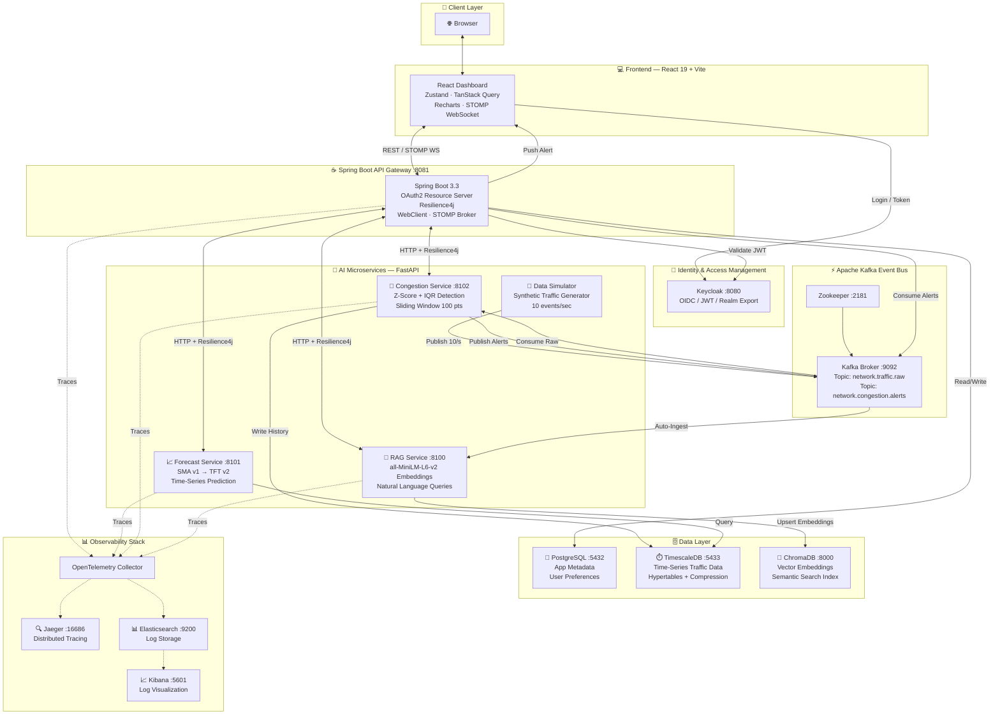
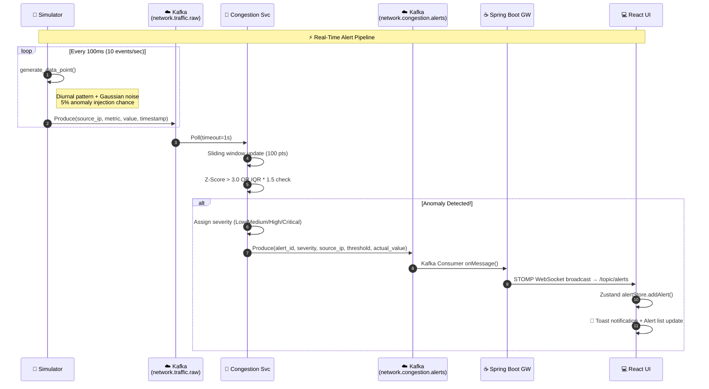
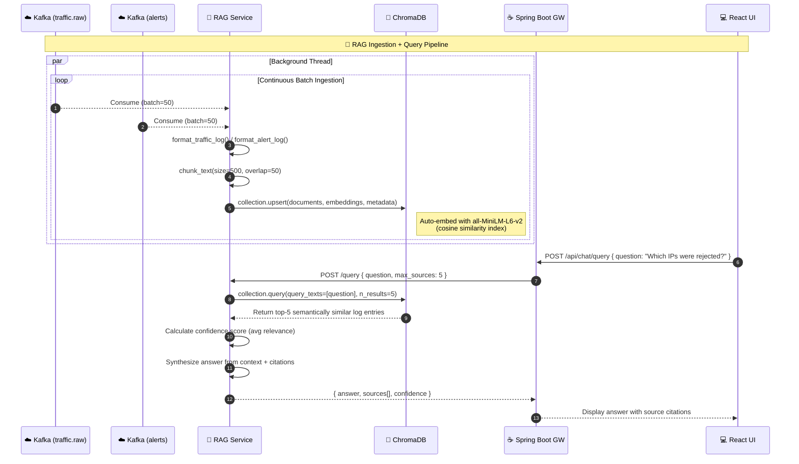
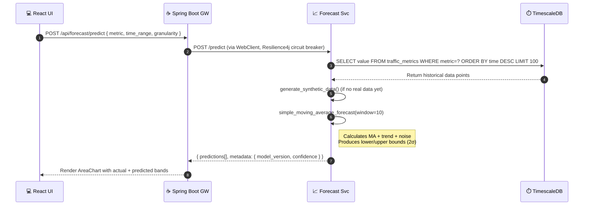
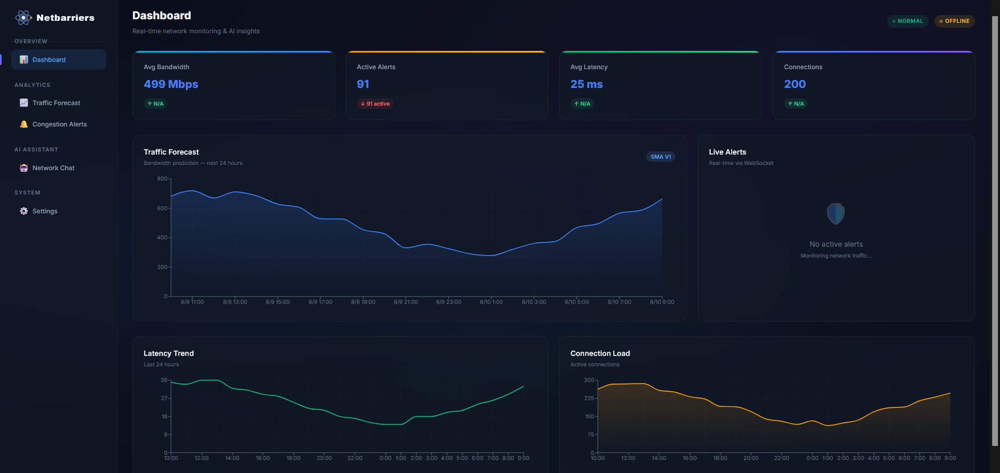
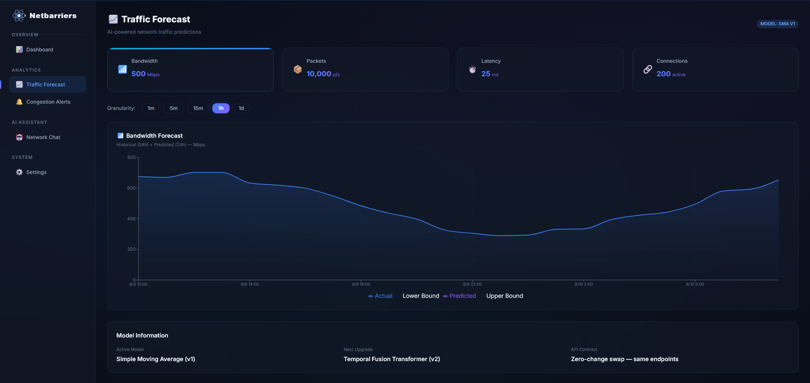
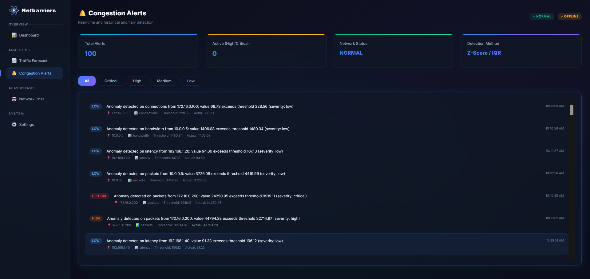
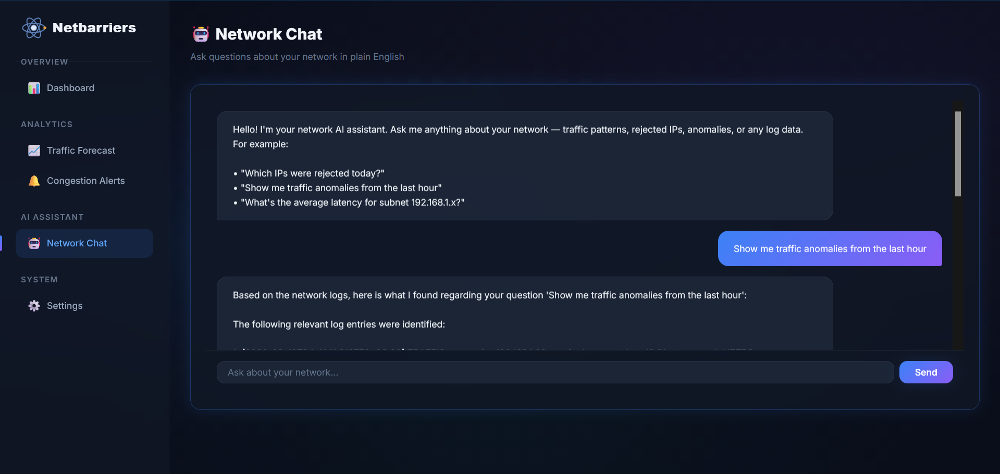

<div align="center">

# 🌐 NetworkTracker

### *An AI-Powered, Real-Time Network Intelligence Platform*

[](https://docker.com)
[](https://spring.io/projects/spring-boot)
[](https://react.dev)
[](https://fastapi.tiangolo.com)
[](https://kafka.apache.org)
[](https://opensource.org/licenses/MIT)

**NetworkTracker** is a production-grade, fully containerized network monitoring and intelligence platform. It combines real-time event streaming via Apache Kafka, AI-powered traffic forecasting, statistical anomaly/congestion detection, and a conversational RAG (Retrieval-Augmented Generation) chatbot — all served through a beautifully designed React dashboard, secured with OAuth2/Keycloak.

[🚀 Quick Start](#-quick-start) · [🏗️ Architecture](#️-system-architecture) · [📦 Services](#-service-breakdown) · [📸 Screenshots](#-screenshots) · [⚙️ Configuration](#️-configuration) · [🔍 Observability](#-observability)

</div>

---

## 📋 Table of Contents

1. [✨ Key Features](#-key-features)
2. [🏗️ System Architecture](#️-system-architecture)
3. [🔄 Data Pipeline & Flow](#-data-pipeline--flow)
4. [📦 Service Breakdown](#-service-breakdown)
   - [💻 React Frontend](#-react-frontend)
   - [☕ Spring Boot API Gateway](#-spring-boot-api-gateway)
   - [🐍 Data Simulator](#-data-simulator)
   - [🐍 Congestion Detection Service](#-congestion-detection-service)
   - [🐍 Traffic Forecasting Service](#-traffic-forecasting-service)
   - [🐍 RAG Chatbot Service](#-rag-chatbot-service)
5. [🗄️ Database Layer](#️-database-layer)
6. [📸 Screenshots](#-screenshots)
7. [🚀 Quick Start](#-quick-start)
8. [⚙️ Configuration](#️-configuration)
9. [🔍 Observability](#-observability)
10. [🛡️ Security](#️-security)
11. [📂 Project Structure](#-project-structure)
12. [🧪 API Reference](#-api-reference)
13. [🛠️ Technology Stack](#️-technology-stack)

---

## ✨ Key Features

| Feature | Description |
|---|---|
| 📡 **Real-Time Streaming** | Network traffic data published to Apache Kafka at 10 events/sec, consumed by multiple downstream services simultaneously |
| 🚨 **Anomaly Detection** | Statistical Z-Score and IQR-based congestion alerts with 4 severity levels (Low → Critical), streamed live to the UI via STOMP WebSocket |
| 📈 **AI Forecasting** | Time-series traffic forecasting using a Simple Moving Average (v1) model, designed for zero-downtime swaps to a Temporal Fusion Transformer (v2) |
| 🤖 **RAG Chatbot** | Conversational AI assistant that answers natural-language questions about network logs using `all-MiniLM-L6-v2` embeddings stored in ChromaDB |
| 🔐 **OAuth2 Security** | Industry-standard Keycloak identity provider securing all API endpoints with JWT token validation |
| 📊 **Observability** | Full distributed tracing via OpenTelemetry → Jaeger, and centralized log aggregation in Elasticsearch → Kibana |
| 🐳 **Fully Containerized** | Every service packaged as a Docker container with health checks, proper dependency ordering, and persistent volumes |
| 🎨 **Premium UI** | Dark glassmorphism design with micro-animations, responsive layouts, and live-updating charts via Recharts |

---

## 🏗️ System Architecture

NetworkTracker follows a **polyglot microservices architecture** where each service owns its domain, communicates asynchronously via Apache Kafka, and is independently deployable. The Spring Boot Gateway acts as the single entry point for all client requests.



---

## 🔄 Data Pipeline & Flow

The system has **two primary data flows** that run simultaneously:

### 🔴 Real-Time Streaming Pipeline (Sub-second latency)



### 🔵 RAG Knowledge Base Pipeline (Continuous ingestion)



### 📈 Forecasting Pipeline



---

## 📦 Service Breakdown

### 💻 React Frontend

> **Port**: `3000` | **Stack**: React 19, Vite 6, TanStack Query, Zustand, Recharts

The frontend is a single-page application (SPA) offering a premium dark-mode interface using glassmorphism design principles. It connects to the Spring Boot Gateway via REST for data queries and maintains a persistent STOMP WebSocket connection for real-time alert push notifications.

**Key Views:**
- 🏠 **Dashboard** — Live stat cards (Avg Bandwidth, Active Alerts, Latency, Connections) dynamically computed from the API. Area and Line charts show bandwidth + connection trends.
- 📈 **Traffic Forecast** — Interactive metric selector (Bandwidth, Packets, Latency, Connections), granularity selector (1m/5m/15m/1h/1d), and 48h chart (24h historical + 24h predicted with confidence bands).
- 🚨 **Live Alerts** — Real-time congestion alert feed rendered with severity badges. Low/Medium/High/Critical each get distinct colour coding.
- 🤖 **Network Chat** — Conversational RAG interface with source citation cards showing log snippets and percentage match scores.
- ⚙️ **Settings** — API endpoint, theme, and alert threshold configuration.

**State Management Flow:**
```
Kafka Alert → Spring Boot WS → Zustand alertStore → All Components
API Query → TanStack Query → Cache → Component render
```

---

### ☕ Spring Boot API Gateway

> **Port**: `8081` | **Stack**: Spring Boot 3.3, Spring Security, Resilience4j, WebFlux WebClient

The gateway is the **single entry point** for all client traffic. It authenticates every request against Keycloak, proxies calls to the downstream Python AI services using reactive `WebClient`, and pushes Kafka-consumed alerts to the frontend via STOMP.

**Key Responsibilities:**

| Module | Details |
|---|---|
| **Security** | OAuth2 Resource Server validates Bearer JWTs against Keycloak's public key (`/.well-known/openid-configuration`) |
| **Resilience** | Resilience4j circuit breaker per downstream AI service — auto opens after 5 consecutive failures, recovers after 30s |
| **Retry Logic** | Exponential backoff with 3 retry attempts on `5xx` errors from AI services |
| **WebSocket** | STOMP broker configured at `/ws`. Broadcasts Kafka-consumed alerts to `/topic/alerts` |
| **Routing** | `/api/forecast/*` → Forecast Service, `/api/congestion/*` → Congestion Service, `/api/chat/*` → RAG Service |

---

### 🐍 Data Simulator

> **Stack**: Python 3.12, confluent-kafka | **Rate**: 10 events/sec

Generates **synthetic but realistic** network traffic data and publishes it to the `network.traffic.raw` Kafka topic. Designed to be a drop-in replacement with a real network probe/SNMP collector.

**How realistic data is generated:**
```
value = base_value
      × diurnal_factor(sin curve peaking at noon)
      + gaussian_noise(σ = noise_scale)
      + [optional] anomaly_spike (3×–8× multiplier, 5% probability)
```

**Simulated Metrics:**
| Metric | Base Value | Noise Scale |
|---|---|---|
| `bandwidth` | 500 Mbps | ±50 Mbps |
| `packets` | 10,000 pkt/s | ±1,000 pkt/s |
| `latency` | 25 ms | ±5 ms |
| `connections` | 200 active | ±30 active |

Each event includes `source_ip`, `destination_ip`, `protocol` (TCP/UDP/HTTP/HTTPS/DNS), `interface` (eth0/eth1/wlan0), and an `is_synthetic: true` flag.

---

### 🐍 Congestion Detection Service

> **Port**: `8102` | **Stack**: Python 3.12, FastAPI, NumPy, confluent-kafka

Runs a **sliding window** over incoming traffic events per metric per source IP and applies two complementary statistical anomaly detection algorithms.

**Algorithms:**

**1. Z-Score Detection**
```
Z = (value - window_mean) / window_std
Anomaly if |Z| > 3.0 (configurable)
```

**2. IQR Detection**
```
Q1, Q3 = 25th, 75th percentile of window
IQR = Q3 - Q1
Lower fence = Q1 - 1.5 × IQR
Upper fence = Q3 + 1.5 × IQR
Anomaly if value < Lower OR value > Upper
```

**Severity Classification:**
| Z-Score | Severity | Action |
|---|---|---|
| 2.0 – 3.0 | 🟡 Low | Logged, soft alert |
| 3.0 – 4.0 | 🟠 Medium | Alert published to Kafka |
| 4.0 – 5.0 | 🔴 High | Alert published to Kafka |
| > 5.0 | 🟣 Critical | Alert published to Kafka |

Detected alerts are published to `network.congestion.alerts` topic with full metadata, then consumed by the Spring Boot Gateway and pushed to the UI via WebSocket.

---

### 🐍 Traffic Forecasting Service

> **Port**: `8101` | **Stack**: Python 3.12, FastAPI, NumPy, TimescaleDB

Provides traffic predictions for a given metric and time range. Built with an explicitly **swappable model interface** — the v1 model (SMA) can be replaced by the v2 model (Temporal Fusion Transformer) without any API contract changes.

**Current Model — SMA v1:**
```python
# Rolling mean over last `window_size` points
ma = mean(values[-window_size:])
std = stddev(values[-window_size:])
trend = (values[-1] - values[-window_size]) / window_size

# Per-step prediction
predicted = ma + trend × (step + 1) + gaussian_noise(σ = std × 0.1)
lower_bound = predicted - 2 × std
upper_bound = predicted + 2 × std
```

**Supported Granularities:** `1m`, `5m`, `15m`, `1h`, `1d`

**Confidence Score:**
```
confidence = min(0.85, 0.5 + len(historical_data) × 0.005)
```

---

### 🐍 RAG Chatbot Service

> **Port**: `8100` | **Stack**: Python 3.12, FastAPI, ChromaDB, confluent-kafka, `all-MiniLM-L6-v2`

The most sophisticated service — it continuously ingests network logs from both Kafka topics into ChromaDB as vector embeddings. When a user asks a natural language question, it performs semantic similarity search to retrieve the most relevant log entries and synthesizes a cited answer.

**Ingestion Pipeline (Background Thread):**
1. Consume from `network.traffic.raw` + `network.congestion.alerts`
2. Format into human-readable log strings
3. Chunk text (500 chars, 50 char overlap)
4. Batch of 50 → `collection.upsert()` into ChromaDB (auto-embedding)
5. Log: `"Auto-ingested 50 docs into ChromaDB (total: X)"`

**Query Pipeline:**
1. Receive `{ question }` from API
2. `collection.query(query_texts=[question], n_results=5)` — cosine similarity search
3. Calculate `relevance_score = 1.0 - cosine_distance`
4. Synthesize answer from top-3 context snippets
5. Return `{ answer, sources[], confidence }`

> 💡 **Note:** The service is designed so that an LLM API key (e.g., OpenAI) can be plugged in to replace the template-based answer synthesis with true GPT-generated responses. Set `RAG_OPENAI_API_KEY` in your `.env` file.

---

## 🗄️ Database Layer

NetworkTracker uses **three purpose-specific databases**, each chosen for the workload it best handles:

### 🐘 PostgreSQL (Port 5432)
Stores all **relational, application-level data**: user preferences, alert acknowledgement history, dashboard configurations, and application metadata. Initialized with `infrastructure/postgres/init.sql`.

### ⏱️ TimescaleDB (Port 5433)
A PostgreSQL extension purpose-built for **time-series data**. All raw traffic metrics from the congestion service are written here with automatic hypertable partitioning by time. Enables efficient queries like "last 24h of bandwidth for IP 192.168.1.10" that would be slow on a standard RDBMS.

**Key TimescaleDB features used:**
- 📦 **Hypertables** — Auto-partition data by time bucket (e.g., 1 day)
- 🗜️ **Compression** — Columnar compression on older chunks
- 📉 **Continuous Aggregates** — Pre-computed hourly/daily rollups

### 🧠 ChromaDB (Port 8000)
An **open-source vector database** that stores embeddings of network log documents for semantic search. All documents are embedded using the `all-MiniLM-L6-v2` model (80MB ONNX model, downloaded automatically on first run).

- **Collection**: `network_logs`
- **Distance Function**: Cosine similarity (`hnsw:space=cosine`)
- **Storage**: Persistent volume at `/chroma/chroma`
- **Documents**: 7,000+ and growing (50 docs ingested per Kafka batch)

---

## 📸 Screenshots

> 📌 *Place your screenshots in the `./screenshots/` folder.*

### 🏠 Dashboard — Real-Time Overview


The central command center showing live **stat cards** computed from actual API data (no hardcoded values), a 48-hour **bandwidth area chart** blending historical data and AI predictions, a latency line chart, and a connections trend chart. Real-time alerts appear as toast notifications when the WebSocket receives a new event.

---

### 📈 Traffic Forecast — AI-Powered Predictions


Interactive metric selector cards allow switching between **Bandwidth**, **Packets**, **Latency**, and **Connections**. Granularity buttons (1m/5m/15m/1h/1d) control the time resolution. The main area chart shows:
- 🔵 **Blue line** — Actual historical data (last 24h)
- 🟣 **Purple dashed line** — AI-predicted future (next 24h)
- 🌫️ **Shaded band** — 95% confidence interval (±2σ)

---

### 🚨 Live Alerts — Real-Time Congestion Detection


A live feed of congestion alerts pushed via STOMP WebSocket. Each alert card shows the **source IP**, **metric**, **actual vs. threshold value**, **detection method** (Z-Score/IQR), and a **severity badge** colour-coded for rapid triage.

---

### 🤖 Network Chat — AI Log Assistant


A conversational interface backed by the RAG service. Ask plain-English questions about your network:
- *"Which IPs were rejected today?"*
- *"Show me traffic anomalies from the last hour"*
- *"What is the average latency for subnet 172.16.0.x?"*

Each answer includes **source citations** with log snippets and percentage match scores, so you can trace every claim back to raw log data.

---

## 🚀 Quick Start

### ✅ Prerequisites

Before you begin, make sure you have the following installed:

| Tool | Minimum Version | Purpose |
|---|---|---|
| [Docker Desktop](https://docker.com) | `24.x` | Container runtime |
| [Docker Compose](https://docs.docker.com/compose/) | `v2.x` | Orchestration |
| Git | any | Clone the repo |

> 💡 **Hardware Recommendation:** 8GB+ RAM for running the full stack comfortably (Elasticsearch is memory-hungry).

---

### 📥 Step 1: Clone the Repository

```bash
git clone https://github.com/your-username/network-tracker.git
cd network-tracker
```

---

### 🔧 Step 2: Configure Environment Variables

Copy the example environment file and customize it:

```bash
cp .env.example .env
```

Open `.env` and at minimum review these settings:

```env
# ── Security (CHANGE IN PRODUCTION) ──
KEYCLOAK_ADMIN_PASSWORD=admin
POSTGRES_PASSWORD=networktracker

# ── Optional: Add an OpenAI key for true LLM-powered RAG answers ──
# RAG_OPENAI_API_KEY=sk-xxxxxxxxxxxxxxxx
# RAG_OPENAI_MODEL=gpt-3.5-turbo

# ── Simulator rate (events per second) ──
SIMULATOR_RATE_PER_SECOND=10
```

---

### 🐳 Step 3: Start the Entire Stack

```bash
docker-compose up -d
```

This single command launches **14+ containers** in the correct dependency order. Watch the initialization with:

```bash
docker-compose logs -f
```

**Expected startup order:**
```
✅ PostgreSQL         → healthy
✅ Zookeeper          → healthy
✅ Keycloak           → healthy (imports realm from realm-export.json)
✅ TimescaleDB        → healthy
✅ ChromaDB           → healthy
✅ Kafka              → healthy
✅ kafka-init         → creates topics (network.traffic.raw, network.congestion.alerts)
✅ Elasticsearch      → healthy
✅ Kibana             → started
✅ Jaeger             → started
✅ Spring Boot        → healthy (waits for Keycloak, Postgres, Kafka)
✅ Forecast Service   → healthy
✅ Congestion Service → healthy
✅ RAG Service        → healthy (downloads ~80MB ONNX model on first run)
✅ Simulator          → started (begins publishing 10 events/sec)
```

> ⏳ **First Run Note:** The RAG service will download the `all-MiniLM-L6-v2` ONNX model (~80MB) automatically. This is a one-time download, stored in a named Docker volume for subsequent runs.

---

### 🌐 Step 4: Access the Services

Once all containers report `healthy` status (`docker-compose ps`), open your browser:

| 🌐 Service | URL | Credentials |
|---|---|---|
| **Frontend Dashboard** | http://localhost:3000 | Keycloak login |
| **API Gateway (Swagger)** | http://localhost:8081/swagger-ui.html | — |
| **Keycloak Admin** | http://localhost:8080 | `admin` / `admin` |
| **RAG Service (Swagger)** | http://localhost:8100/docs | — |
| **Forecast Service** | http://localhost:8101/docs | — |
| **Congestion Service** | http://localhost:8102/docs | — |
| **ChromaDB UI** | http://localhost:8000 | — |
| **Kibana (Logs)** | http://localhost:5601 | — |
| **Jaeger (Traces)** | http://localhost:16686 | — |

---

### 🛑 Stopping the Stack

```bash
# Stop all containers (preserves volumes)
docker-compose down

# Stop AND delete all data volumes (full reset)
docker-compose down -v
```

---

## ⚙️ Configuration

All configuration is managed through environment variables defined in `.env` and passed to containers in `docker-compose.yml`.

### Congestion Detection Thresholds

| Variable | Default | Description |
|---|---|---|
| `CONGESTION_Z_SCORE_THRESHOLD` | `3.0` | Z-score above which a reading is anomalous |
| `CONGESTION_IQR_MULTIPLIER` | `1.5` | IQR fence multiplier (standard = 1.5) |
| `CONGESTION_WINDOW_SIZE` | `100` | Sliding window of data points per metric/IP |
| `CONGESTION_SEVERITY_LOW` | `2.0` | Minimum Z-score for "Low" severity |
| `CONGESTION_SEVERITY_CRITICAL` | `5.0` | Minimum Z-score for "Critical" severity |

### Simulator Configuration

| Variable | Default | Description |
|---|---|---|
| `SIMULATOR_RATE_PER_SECOND` | `10` | Kafka publish rate |
| `SIMULATOR_ANOMALY_PROBABILITY` | `0.05` | Probability of injecting an anomalous spike (5%) |

### RAG Service Configuration

| Variable | Default | Description |
|---|---|---|
| `RAG_OPENAI_API_KEY` | *(empty)* | OpenAI API key for LLM-powered answers |
| `RAG_OPENAI_MODEL` | `gpt-3.5-turbo` | OpenAI model to use |
| `RAG_CHROMADB_HOST` | `chromadb` | ChromaDB hostname |
| `RAG_COLLECTION_NAME` | `network_logs` | ChromaDB collection name |

### Forecast Service Configuration

| Variable | Default | Description |
|---|---|---|
| `FORECAST_MODEL_VERSION` | `sma-v1` | Active forecasting model |
| `FORECAST_TIMESCALEDB_HOST` | `timescaledb` | TimescaleDB hostname |

---

## 🔍 Observability

NetworkTracker ships with a full observability stack out of the box.

### 📊 Distributed Tracing with Jaeger

All Spring Boot + FastAPI services instrument their requests with **OpenTelemetry** and export traces to the **Jaeger** backend. You can trace a single user request end-to-end, from the React UI → Gateway → AI Service → Database → back to UI.

```
http://localhost:16686
```

Use case: Find why a `/api/chat/query` call took 1.5 seconds. The Jaeger trace will show exactly how long the ChromaDB similarity search took vs. network latency.

### 📈 Centralized Logging with Kibana

All service logs (structured JSON format) are collected by the OpenTelemetry Collector and shipped to **Elasticsearch**. **Kibana** provides powerful log search and dashboard capabilities.

```
http://localhost:5601
```

Sample log query to find all `Critical` alerts:
```json
{ "query": { "match": { "severity": "critical" } } }
```

### 🏥 Health Checks

All services expose health endpoints:

```bash
curl http://localhost:8081/actuator/health    # Spring Boot
curl http://localhost:8100/health             # RAG Service
curl http://localhost:8101/health             # Forecast Service
curl http://localhost:8102/health             # Congestion Service
```

---

## 🛡️ Security

### OAuth2 / Keycloak

All API endpoints on the Spring Boot Gateway are protected with **Bearer token authentication**. The flow is:

1. 👤 User accesses the React frontend
2. 🔐 React redirects to Keycloak login page
3. ✅ User authenticates → Keycloak issues JWT access token
4. 📤 React includes `Authorization: Bearer <token>` in every API call
5. ☕ Spring Boot validates the JWT signature against Keycloak's public key

**Keycloak Realm** is automatically imported from `infrastructure/keycloak/realm-export.json` on first startup. It includes:
- Pre-configured `networktracker` realm
- `networktracker-frontend` OIDC client (public, for SPA login)
- `networktracker-backend` confidential client (for service-to-service auth)
- Default admin user

### Network Isolation

All containers communicate on an isolated Docker bridge network (`networktracker-net`). Only explicitly declared ports are published to the host machine. Internal service-to-service communication uses container DNS names (e.g., `http://rag-service:8100`).

---

## 📂 Project Structure

```
network-tracker/
│
├── 📄 docker-compose.yml          # Full orchestration (14+ services)
├── 📄 .env.example                # Environment variable template
├── 📄 README.md                   # This file!
│
├── 💻 frontend/                   # React 19 + Vite 6 SPA
│   ├── src/
│   │   ├── api/client.js          # Axios-like fetch wrapper
│   │   ├── components/            # Page components
│   │   │   ├── Dashboard.jsx      # Live stats + charts
│   │   │   ├── ForecastView.jsx   # AI traffic predictions
│   │   │   ├── AlertsView.jsx     # Real-time alert feed
│   │   │   └── ChatInterface.jsx  # RAG chatbot UI
│   │   ├── stores/alertStore.js   # Zustand + STOMP WebSocket
│   │   └── index.css              # Glassmorphism design system
│   └── Dockerfile                 # Multi-stage: build → nginx serve
│
├── ☕ backend/                     # Spring Boot API Gateway
│   └── src/main/java/com/networktracker/
│       ├── config/                # Security, Resilience4j, WebSocket, WebClient config
│       ├── controller/            # REST endpoints (Forecast, Congestion, Chat, Auth)
│       ├── service/               # WebClient proxy clients to AI services
│       ├── dto/                   # Request/Response DTOs (OpenAPI contract)
│       └── websocket/             # STOMP broker + Kafka consumer push
│
├── 🐍 ai-services/
│   ├── simulator/                 # Synthetic traffic data producer
│   │   └── main.py               # Kafka producer, diurnal + noise generator
│   │
│   ├── congestion/                # Real-time anomaly detection
│   │   └── main.py               # Z-Score + IQR detector, Kafka consumer/producer
│   │
│   ├── forecast/                  # Traffic prediction service
│   │   └── main.py               # SMA v1 model, TimescaleDB integration
│   │
│   └── rag/                       # RAG chatbot + auto-ingestion
│       └── main.py               # ChromaDB client, Kafka ingester, query endpoint
│
├── 🗄️ infrastructure/
│   ├── keycloak/realm-export.json # Pre-configured Keycloak realm
│   ├── postgres/init.sql          # PostgreSQL schema init
│   └── timescaledb/init.sql       # TimescaleDB hypertable setup
│
└── 📋 contracts/                  # OpenAPI YAML specs (API contracts)
    ├── gateway-api.yaml
    ├── forecast-service.yaml
    ├── congestion-service.yaml
    └── rag-service.yaml
```

---

## 🧪 API Reference

### Gateway API — `http://localhost:8081`

| Method | Endpoint | Description |
|---|---|---|
| `GET` | `/api/auth/userinfo` | Get authenticated user info |
| `POST` | `/api/forecast/predict` | Generate traffic forecast |
| `GET` | `/api/forecast/history` | Get historical traffic data |
| `GET` | `/api/congestion/status` | Overall network health status |
| `GET` | `/api/congestion/alerts` | List recent congestion alerts |
| `POST` | `/api/chat/query` | Ask a natural language question |
| `GET` | `/api/chat/history` | Retrieve chat history |

### Sample: Forecast Request

```bash
curl -X POST http://localhost:8081/api/forecast/predict \
  -H "Content-Type: application/json" \
  -d '{
    "metric": "bandwidth",
    "granularity": "1h",
    "time_range": {
      "start": "2026-08-10T00:00:00Z",
      "end": "2026-08-10T12:00:00Z"
    }
  }'
```

### Sample: Chat Query

```bash
curl -X POST http://localhost:8081/api/chat/query \
  -H "Content-Type: application/json" \
  -d '{"question": "Which IPs had the highest bandwidth in the last hour?"}'
```

---

## 🛠️ Technology Stack

### 🎨 Frontend
| Technology | Version | Purpose |
|---|---|---|
| React | 19 | Core UI framework |
| Vite | 6 | Lightning-fast build tool |
| TanStack Query | 5 | Data fetching, caching, sync |
| Zustand | 4 | Lightweight global state (alerts) |
| Recharts | 2 | Interactive data visualization |
| STOMP.js | 7 | WebSocket client for real-time alerts |

### ☕ Backend
| Technology | Version | Purpose |
|---|---|---|
| Spring Boot | 3.3 | API Gateway + Business Logic |
| Spring Security | 6 | OAuth2 Resource Server |
| Spring WebFlux | 6 | Reactive WebClient for AI services |
| Resilience4j | 2 | Circuit breaker, retry, rate limiter |
| Spring WebSocket | 6 | STOMP broker for real-time push |
| Kafka (Spring) | 3.x | Alert topic consumer |

### 🐍 AI Services
| Technology | Version | Purpose |
|---|---|---|
| FastAPI | 0.110+ | Async Python REST framework |
| Pydantic | 2 | Data validation & settings |
| confluent-kafka | 2.x | Kafka producer/consumer |
| ChromaDB | latest | Vector database for RAG |
| NumPy | 1.26+ | Statistical computation |
| all-MiniLM-L6-v2 | — | Sentence embedding model (80MB ONNX) |

### 🗄️ Infrastructure
| Technology | Version | Purpose |
|---|---|---|
| Apache Kafka | 7.6.0 (CP) | Event streaming backbone |
| Zookeeper | 7.6.0 (CP) | Kafka cluster coordination |
| PostgreSQL | 16 | Relational application data |
| TimescaleDB | pg16-latest | Time-series traffic metrics |
| ChromaDB | latest | Vector store for embeddings |
| Keycloak | 24.0 | Identity & access management |
| Elasticsearch | 8.13 | Centralized log storage |
| Kibana | 8.13 | Log visualization |
| Jaeger | latest | Distributed tracing UI |
| OpenTelemetry | latest | Trace/metric collection |
| Docker | 24+ | Containerization |
| Docker Compose | v2 | Local orchestration |

---

## 🤝 Contributing

Contributions are welcome! Please follow these guidelines:

1. **API Contract First** — Any change to service endpoints must first be reflected in the corresponding OpenAPI YAML spec in `contracts/`
2. **Health Checks** — New services must expose a `/health` endpoint and be registered in `docker-compose.yml` with a proper healthcheck
3. **Environment Variables** — Add any new config options to `.env.example` with sensible defaults
4. **No Hardcoded Data** — The frontend must always fetch data from real API endpoints

---

## 📜 License

This project is licensed under the **MIT License** — see the [LICENSE](LICENSE) file for details.

---

<div align="center">

Made with ❤️ by the Harshit Gupta

⭐ **Star this repo** if you find it useful!

</div>
